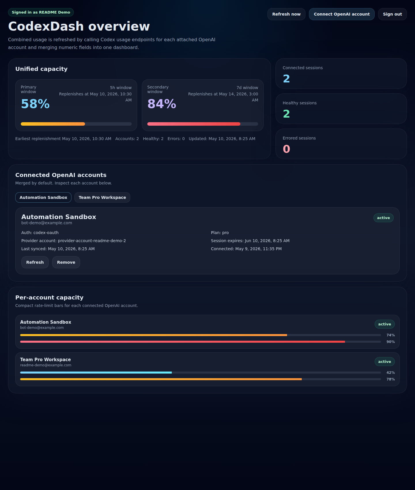

# CodexDash

CodexDash is a mobile-first dashboard for monitoring multiple OpenAI Codex accounts from one place. It combines shared capacity signals, connected-account health, and per-account usage into a single dark-mode dashboard built for fast daily checks.



## Overview

CodexDash helps you keep track of several Codex-backed OpenAI accounts without bouncing between browser sessions or manually comparing usage pages. The app gives you an aggregate capacity view, connected-account status cards, and compact per-account capacity bars so you can see both the fleet-level picture and the individual account state at a glance.

## Features

- **Unified capacity overview** with primary and secondary rate-limit windows
- **Multi-account monitoring** under a single CodexDash user account
- **Per-account capacity bars** for quick side-by-side usage checks
- **Connected-session health summary** with active vs errored account counts
- **Integrated OpenAI login flow** with popup-based OAuth and a manual callback fallback
- **Responsive dashboard UI** designed to work well on mobile and desktop

## Stack

- **Frontend:** React + Vite + TypeScript + Tailwind CSS + shadcn/ui-style components
- **Backend:** NestJS
- **Database:** Prisma + SQLite
- **Auth:** CodexDash email/password auth with JWT

## OpenAI/Codex login flow

CodexDash uses an app-native OAuth/PKCE flow for connecting OpenAI accounts:

1. The user clicks **Connect OpenAI account**.
2. CodexDash API creates a short-lived PKCE login attempt.
3. The web app opens the OpenAI authorization page in a popup.
4. After successful login, OpenAI redirects back to the local callback bridge at `http://localhost:1455/auth/callback`.
5. The callback bridge exchanges the authorization code for tokens, encrypts the session JSON in SQLite, and posts the result back to the main app window.
6. If the callback bridge is unavailable, the user can copy the final `localhost:1455` URL from the browser address bar and paste it back into CodexDash to finish the same login attempt manually.
7. CodexDash refreshes usage using the saved OAuth session and shows both the aggregate view and per-account details.

### Important local-dev note

This flow works best when the local callback bridge is reachable on `localhost:1455`, but CodexDash now also supports a manual fallback where the user pastes the final callback URL if that port is unavailable. In local development, make sure that port is free if you want the automatic popup completion path.

## Local development

```bash
bun install
cd apps/api && DATABASE_URL=file:./dev.db bunx prisma db push --accept-data-loss
cd ../..
bun run dev:api
bun run dev:web -- --host 0.0.0.0
```

## Docker image

The production image uses a multi-stage build:
- `bun install` + frontend build in the builder stage
- `bun build --compile` to emit a single API executable at `apps/api/dist/codexdash`
- the Prisma query engine shared library copied alongside the binary so the compiled app can still talk to SQLite
- the container auto-bootstraps the SQLite schema for fresh `file:` databases before Prisma connects
- a distroless non-root runtime image that only contains the compiled binary, Prisma engine library, and the built web assets

Build the image locally:

```bash
docker build -t codexdash:latest .
```

Pull a published image from GitHub Container Registry:

```bash
docker pull ghcr.io/p-sw/codexdash:latest
# or pin a release tag
docker pull ghcr.io/p-sw/codexdash:v1.0.0
```

## Docker quick start

If you just want to run CodexDash immediately with Docker, this is the fastest path:

```bash
mkdir -p ./codexdash-data && \
docker run -d \
  --name codexdash \
  --restart unless-stopped \
  -p 3001:3001 \
  -p 1455:1455 \
  -e JWT_SECRET=replace-with-a-long-random-secret \
  -e ENCRYPTION_SECRET=replace-with-a-long-random-secret \
  -e DATABASE_URL=file:/app/data/codexdash.db \
  -e CODEXDASH_FRONTEND_ORIGIN=http://localhost:3001 \
  -e CODEX_OAUTH_REDIRECT_URI=http://localhost:1455/auth/callback \
  -e CODEX_OAUTH_CALLBACK_BIND_HOST=0.0.0.0 \
  -v "$(pwd)/codexdash-data:/app/data" \
  ghcr.io/p-sw/codexdash:latest
```

Then open `http://localhost:3001` in your browser.

### Use a pinned release instead of `latest`

For a repeatable deployment, swap the image tag:

```bash
docker run -d \
  --name codexdash \
  --restart unless-stopped \
  -p 3001:3001 \
  -p 1455:1455 \
  -e JWT_SECRET=replace-with-a-long-random-secret \
  -e ENCRYPTION_SECRET=replace-with-a-long-random-secret \
  -e DATABASE_URL=file:/app/data/codexdash.db \
  -e CODEXDASH_FRONTEND_ORIGIN=http://localhost:3001 \
  -e CODEX_OAUTH_REDIRECT_URI=http://localhost:1455/auth/callback \
  -e CODEX_OAUTH_CALLBACK_BIND_HOST=0.0.0.0 \
  -v "$(pwd)/codexdash-data:/app/data" \
  ghcr.io/p-sw/codexdash:v1.0.0
```

### Verify the container

```bash
curl http://localhost:3001/health
docker logs codexdash --tail 100
```

### Notes
- The container serves the built React app from the same process on port `3001`.
- The bundled frontend defaults to the browser's current origin for API calls, so the production image can be deployed behind any host name without rebuilding the web bundle.
- `VITE_API_BASE_URL` is optional and mainly useful for local development when Vite runs on a different origin than the API.
- `CODEX_OAUTH_CALLBACK_BIND_HOST=0.0.0.0` keeps the callback bridge reachable through Docker port publishing while the public redirect URL stays on `http://localhost:1455/auth/callback`.
- Fresh SQLite `file:` databases are initialized automatically on first boot, so a brand-new volume can be used without running `prisma db push` inside the container.
- Runtime assets live under `/app`: the compiled server is `/app/codexdash`, the built SPA is `/app/web`, the Prisma engine is `/app/prisma/libquery_engine.so.node`, and writable app data defaults to `/app/data`.
- To keep data across container re-creates, reuse the same `/app/data` bind mount or named volume.
- If the callback bridge is still unreachable in your setup, the manual callback URL paste fallback remains available.

## Environment variables

### Root `.env`

```env
JWT_SECRET=replace-me
ENCRYPTION_SECRET=replace-with-at-least-32-characters
DATABASE_URL=file:./dev.db
CODEXDASH_FRONTEND_ORIGIN=http://localhost:5173
CODEX_OAUTH_REDIRECT_URI=http://localhost:1455/auth/callback
# Optional in local dev when the web app does not share the API origin.
VITE_API_BASE_URL=http://localhost:3001
```

## Verification

```bash
bun run lint
bun run test
bun run build
curl http://localhost:3001/health
```

## API overview

- `POST /auth/register`
- `POST /auth/login`
- `GET /auth/me`
- `GET /codex/accounts`
- `POST /codex/accounts/login/start`
- `GET /codex/accounts/login/attempts/:attemptId`
- `DELETE /codex/accounts/login/attempts/:attemptId`
- `GET /codex/accounts/login/callback`
- `GET /codex/accounts`
- `DELETE /codex/accounts/:accountId`
- `GET /codex/usage-summary`
